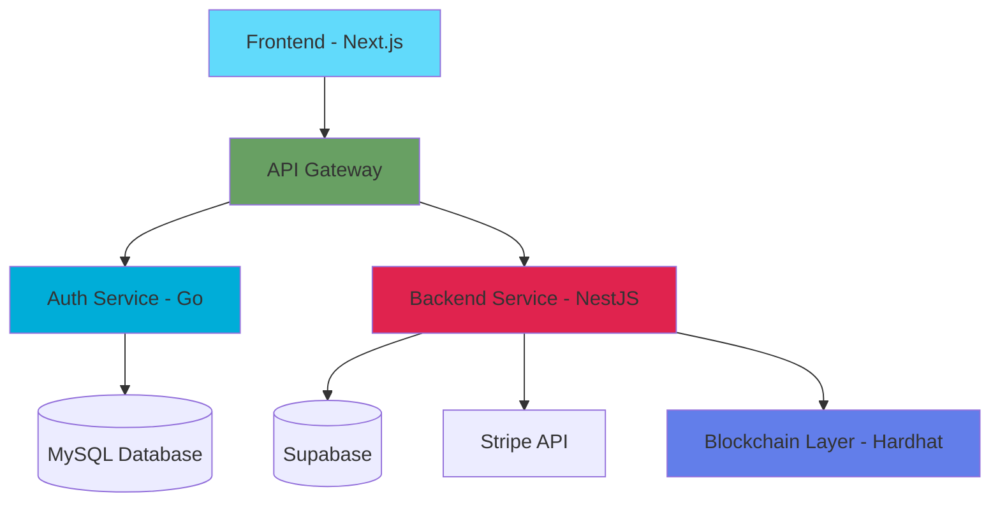

# Smart Contract Management Platform

A distributed microservices-based web application for creating, managing, and signing digital contracts with blockchain verification. This platform combines traditional web technologies with blockchain technology to provide secure, verifiable, and transparent contract management.

## 📋 Table of Contents

- [Overview](#overview)
- [Features](#features)
- [Architecture](#architecture)
- [Tech Stack](#tech-stack)
- [Project Structure](#project-structure)
- [Prerequisites](#prerequisites)
- [Installation](#installation)
- [Running the Application](#running-the-application)
- [Environment Variables](#environment-variables)
- [API Documentation](#api-documentation)
- [Development](#development)
- [Contributing](#contributing)

## 🌟 Overview

This platform enables users to create, negotiate, and sign contracts digitally with blockchain-backed verification. It features a subscription-based model with different tiers (Standard and Creator plans), a marketplace for contract templates, real-time collaboration, and integration with Stripe for payments and Ethereum blockchain for contract verification.

## ✨ Features

### Core Features
- **User Authentication & Authorization**
  - Google OAuth integration
  - Session-based authentication
  - Role-based access control

- **Contract Management**
  - Create and edit contracts with rich text editor
  - Save contracts as templates
  - Purchase and use contract templates from marketplace
  - Multi-party contract signing
  - Contract versioning and tracking
  - Delete and revoke agreement functionality

- **Blockchain Integration**
  - Smart contract deployment on Ethereum
  - Contract verification and immutability
  - Blockchain-backed signatures
  - Transaction tracking

- **Subscription System**
  - Standard Plan: Basic contract features
  - Creator Plan: Template selling, advanced features
  - Stripe integration for payments
  - Webhook support for payment events

- **Marketplace**
  - Browse and purchase contract templates
  - Sell templates (Creator plan only)
  - Rating and review system
  - Template categories and search

- **Real-time Features**
  - Live contract editing
  - Notification system
  - Audit logging

## 🏗️ Architecture

This application follows a microservices architecture with the following services:



### Services

1. **Frontend** (Port 3000)
   - Next.js 15 application with React 19
   - Server-side rendering and API routes
   - Tailwind CSS for styling
   - Supabase client for database operations

2. **API Gateway** (Port 8000)
   - Routes requests to appropriate microservices
   - Handles CORS and authentication middleware
   - Request/response transformation

3. **Auth Service** (Port 3060)
   - Built with Go
   - Handles user authentication and authorization
   - Google OAuth integration
   - Session management with MySQL

4. **Backend Service** (Port 5000)
   - NestJS application
   - Core business logic
   - Contract CRUD operations
   - Subscription management with Stripe
   - Blockchain interaction via ethers.js

5. **Blockchain Layer** (Port 8545)
   - Hardhat development network
   - Smart contract deployment and testing
   - Contract registry for verification

## 🛠️ Tech Stack

### Frontend
- **Framework**: Next.js 15.5.5 (Turbopack enabled)
- **UI Library**: React 19.1.0
- **Styling**: Tailwind CSS 4
- **Icons**: Lucide React
- **Charts**: Recharts
- **Database Client**: Supabase JS
- **Blockchain**: Ethers.js 6.16.0
- **Language**: TypeScript 5

### Backend Services

#### NestJS Backend
- **Framework**: NestJS 11
- **Runtime**: Node.js 20
- **Database**: Supabase (PostgreSQL)
- **Payments**: Stripe
- **Blockchain**: Ethers.js
- **Validation**: Class Validator & Class Transformer
- **Language**: TypeScript 5.7

#### Auth Service
- **Language**: Go
- **Database**: MySQL 8.0
- **Authentication**: OAuth 2.0 (Google)
- **Session Management**: Cookie-based sessions

### Blockchain
- **Development Framework**: Hardhat 2.22
- **Smart Contracts**: Solidity
- **Testing**: Hardhat Toolbox
- **Network**: Local Hardhat Node (development)

### DevOps & Tools
- **Containerization**: Docker & Docker Compose
- **Database Admin**: Adminer
- **Payment Testing**: Stripe CLI
- **Package Manager**: npm

## 📁 Project Structure

```
MiniprojetV0/
├── frontend/                 # Next.js frontend application
│   ├── src/
│   │   ├── app/             # Next.js app directory
│   │   └── lib/             # Utility functions and clients
│   ├── public/              # Static assets
│   └── package.json
│
├── backend_nest/            # NestJS backend service
│   ├── src/
│   │   ├── contracts/       # Contract module
│   │   ├── subscriptions/   # Subscription & payment module
│   │   └── main.ts         # Application entry point
│   └── package.json
│
├── auth/                    # Go authentication service
│   ├── cmd/                # Application entry points
│   ├── internal/           # Internal packages
│   │   ├── handlers/       # HTTP handlers
│   │   ├── models/         # Data models
│   │   └── middleware/     # Auth middleware
│   ├── go.mod
│   └── Dockerfile
│
├── gateway/                # API Gateway service
│   └── (gateway configuration)
│
├── blockchain/             # Hardhat blockchain project
│   ├── contracts/         # Solidity smart contracts
│   │   └── ContractRegistry.sol
│   ├── scripts/           # Deployment scripts
│   ├── test/              # Smart contract tests
│   └── hardhat.config.ts
│
├── k8s/                   # Kubernetes manifests (for future deployment)
├── docker-compose.yml     # Docker orchestration
└── README.md             # This file
```

## 📋 Prerequisites

Before running this application, ensure you have the following installed:

- **Docker** (version 20.10+) and **Docker Compose** (version 2.0+)
- **Node.js** (version 20+) - for local development
- **Go** (version 1.21+) - for auth service development
- **MySQL** (version 8.0) - or use Docker container
- **Git** - for version control

### External Services Setup

You'll also need accounts and API keys for:

1. **Supabase**
   - Create a project at [supabase.com](https://supabase.com)
   - Get your project URL and anon key

2. **Stripe**
   - Create an account at [stripe.com](https://stripe.com)
   - Get your API keys (test mode)
   - Set up product IDs for subscription plans

3. **Google OAuth**
   - Create a project in [Google Cloud Console](https://console.cloud.google.com)
   - Enable Google+ API
   - Create OAuth 2.0 credentials
   - Add authorized redirect URIs

## 🚀 Installation

### 1. Clone the Repository

```bash
git clone <repository-url>
cd MiniprojetV0
```

### 2. Set Up Environment Variables

Create `.env` files for each service. Here's what you need:

#### Root `.env` (for docker-compose)

```env
# MySQL Configuration
MYSQL_ROOT_PASSWORD=your_root_password
MYSQL_DATABASE=miniprojet
MYSQL_USER=miniprojet_user
MYSQL_PASSWORD=your_mysql_password

# Supabase Configuration
SUPABASE_URL=https://your-project.supabase.co
SUPABASE_ANON_KEY=your-supabase-anon-key

# Stripe Configuration
STRIPE_SECRET_KEY=sk_test_...
STRIPE_WEBHOOK_SECRET=whsec_...
```

#### Auth Service `.env` (auth/.env)

```env
PORT=3060
DB_HOST=mysql-db
DB_PORT=3306
DB_USER=miniprojet_user
DB_PASSWORD=your_mysql_password
DB_NAME=miniprojet

GOOGLE_CLIENT_ID=your-google-client-id.apps.googleusercontent.com
GOOGLE_CLIENT_SECRET=your-google-client-secret
GOOGLE_REDIRECT_URL=http://localhost:8000/auth/google/callback

SESSION_SECRET=your-session-secret-key
FRONTEND_URL=http://localhost:3000
GATEWAY_URL=http://localhost:8000
```

#### Backend NestJS `.env` (backend_nest/.env)

```env
PORT=5000
NODE_ENV=development

SUPABASE_URL=https://your-project.supabase.co
SUPABASE_ANON_KEY=your-supabase-anon-key
SUPABASE_SERVICE_KEY=your-supabase-service-key

STRIPE_SECRET_KEY=sk_test_...
STRIPE_WEBHOOK_SECRET=whsec_...
STRIPE_STANDARD_PRICE_ID=price_...
STRIPE_CREATOR_PRICE_ID=price_...

HARDHAT_NETWORK_URL=http://hardhat-node:8545
CONTRACT_REGISTRY_ADDRESS=0x... (will be set after deployment)

AUTH_SERVICE_URL=http://auth-service:3060
GATEWAY_URL=http://gateway:8000
```

#### Frontend `.env.local` (frontend/.env.local)

```env
NEXT_PUBLIC_API_URL=http://localhost:8000
NEXT_PUBLIC_SUPABASE_URL=https://your-project.supabase.co
NEXT_PUBLIC_SUPABASE_ANON_KEY=your-supabase-anon-key
```

### 3. Install Dependencies (Optional - for local development)

If you want to run services locally without Docker:

```bash
# Frontend
cd frontend
npm install

# Backend
cd ../backend_nest
npm install

# Blockchain
cd ../blockchain
npm install

# Auth Service
cd ../auth
go mod download
```

## 🏃 Running the Application

### Using Docker Compose (Recommended)

This is the easiest way to run the entire application with all services:

```bash
# Build and start all services
docker-compose up --build

# Or run in detached mode
docker-compose up -d

# View logs
docker-compose logs -f

# Stop all services
docker-compose down

# Stop and remove volumes (clean slate)
docker-compose down -v
```

### Service URLs

Once running, access the services at:

- **Frontend**: http://localhost:3000
- **API Gateway**: http://localhost:8000
- **Auth Service**: http://localhost:3060
- **Backend Service**: http://localhost:5000
- **Adminer (Database UI)**: http://localhost:8081
- **Hardhat Node (Blockchain)**: http://localhost:8545

### Running Services Individually

#### Frontend
```bash
cd frontend
npm run dev
```

#### Backend
```bash
cd backend_nest
npm run start:dev
```

#### Auth Service
```bash
cd auth
go run cmd/main.go
# Or use air for hot reload
air
```

#### Blockchain
```bash
cd blockchain
npm run node
# In another terminal, deploy contracts
npm run deploy
```

## 🔐 Environment Variables

### Required Variables

| Variable | Description | Example |
|----------|-------------|---------|
| `SUPABASE_URL` | Supabase project URL | `https://xxx.supabase.co` |
| `SUPABASE_ANON_KEY` | Supabase anonymous key | `eyJ...` |
| `STRIPE_SECRET_KEY` | Stripe secret key | `sk_test_...` |
| `GOOGLE_CLIENT_ID` | Google OAuth client ID | `xxx.apps.googleusercontent.com` |
| `GOOGLE_CLIENT_SECRET` | Google OAuth secret | `GOCSPX-...` |
| `MYSQL_ROOT_PASSWORD` | MySQL root password | `securepassword` |

### Optional Variables

| Variable | Description | Default |
|----------|-------------|---------|
| `PORT` | Service port | `3000/5000/3060` |
| `NODE_ENV` | Environment | `development` |
| `SESSION_SECRET` | Session encryption key | Random string |

## 📚 API Documentation

### Authentication Endpoints

```
POST   /auth/google              # Initiate Google OAuth
GET    /auth/google/callback     # OAuth callback
POST   /auth/logout             # Logout user
GET    /auth/me                 # Get current user
```

### Contract Endpoints

```
GET    /api/contracts           # List all contracts
POST   /api/contracts           # Create contract
GET    /api/contracts/:id       # Get contract details
PUT    /api/contracts/:id       # Update contract
DELETE /api/contracts/:id       # Delete contract
POST   /api/contracts/:id/sign  # Sign contract
POST   /api/contracts/:id/revoke # Revoke agreement
```

### Subscription Endpoints

```
GET    /api/subscriptions       # Get user subscription
POST   /api/subscriptions/create # Create subscription
POST   /api/subscriptions/webhook # Stripe webhook
POST   /api/subscriptions/cancel # Cancel subscription
```

### Marketplace Endpoints

```
GET    /api/marketplace         # List templates
GET    /api/marketplace/:id     # Get template details
POST   /api/marketplace/purchase # Purchase template
```

## 💻 Development

### Development Workflow

1. **Make changes** to your code
2. **Test locally** using Docker Compose or individual services
3. **Run tests** (if available)
4. **Commit changes** with meaningful messages
5. **Push to repository**

### Hot Reload

All services support hot reload in development:

- **Frontend**: Turbopack (Next.js)
- **Backend**: NestJS watch mode
- **Auth**: Air (Go live reload)

### Database Management

Access the database through Adminer:
1. Open http://localhost:8081
2. Login with MySQL credentials
3. Manage tables, run queries, etc.

### Blockchain Development

```bash
cd blockchain

# Compile contracts
npm run compile

# Run tests
npm run test

# Deploy to local network
npm run deploy
```

### Stripe Testing

Use Stripe CLI to test webhooks locally:

```bash
# Login to Stripe
stripe login

# Forward webhooks
stripe listen --forward-to localhost:5000/api/subscriptions/webhook
```

Test cards:
- Success: `4242 4242 4242 4242`
- Decline: `4000 0000 0000 0002`

## 🐛 Troubleshooting

### Common Issues

**Issue**: Services can't connect to each other
- **Solution**: Ensure all services are on the same Docker network (`miniprojet-net`)

**Issue**: MySQL health check fails
- **Solution**: Wait for MySQL to fully initialize (can take 30-60 seconds)

**Issue**: Frontend can't reach API
- **Solution**: Check CORS settings in gateway and ensure `NEXT_PUBLIC_API_URL` is correct

**Issue**: Blockchain deployment fails
- **Solution**: Ensure Hardhat node is running and contract addresses are updated in backend config

**Issue**: Google OAuth fails
- **Solution**: Verify redirect URIs in Google Cloud Console match your gateway URL

### Logs

View service logs:
```bash
# All services
docker-compose logs -f

# Specific service
docker-compose logs -f backend_nest
docker-compose logs -f auth-service
```

## 🤝 Contributing

1. Fork the repository
2. Create a feature branch (`git checkout -b feature/amazing-feature`)
3. Commit your changes (`git commit -m 'Add amazing feature'`)
4. Push to the branch (`git push origin feature/amazing-feature`)
5. Open a Pull Request

## 📄 License

This project is licensed under the UNLICENSED - see individual service licenses for details.

## 👥 Authors

- Project developed as part of academic coursework
- Maintained by the development team

## 🙏 Acknowledgments

- Next.js team for the amazing framework
- NestJS for the backend architecture
- Hardhat for blockchain development tools
- Supabase for the database solution
- Stripe for payment processing
- Google for OAuth integration

---

