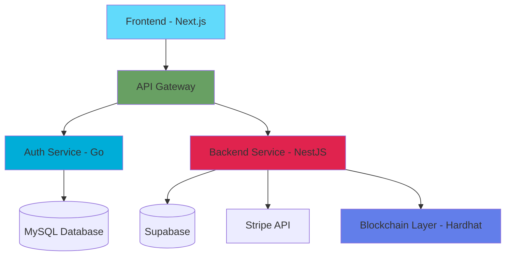

# Smart Contract Management Platform

A distributed microservices-based web application for creating, managing, and signing digital contracts with blockchain verification. This platform combines traditional web technologies with blockchain technology to provide secure, verifiable, and transparent contract management.

## 📋 Table of Contents

- [Overview](#overview)
- [Features](#features)
- [Architecture](#architecture)
- [Tech Stack](#tech-stack)
- [Project Structure](#project-structure)
- [Prerequisites](#prerequisites)
- [Installation](#installation)
- [Running the Application](#running-the-application)
  - [Local Development (Docker Compose)](#using-docker-compose-recommended)
  - [Kubernetes Deployment](#kubernetes-deployment)
  - [Azure AKS Deployment](#azure-aks-deployment)
- [Environment Variables](#environment-variables)
- [API Documentation](#api-documentation)
- [Development](#development)
- [Production Deployment](#production-deployment)
- [Troubleshooting](#troubleshooting)
- [Contributing](#contributing)

## 🌟 Overview

This platform enables users to create, negotiate, and sign contracts digitally with blockchain-backed verification. It features a subscription-based model with different tiers (Standard and Creator plans), a marketplace for contract templates, real-time collaboration, and integration with Stripe for payments and Ethereum blockchain for contract verification.

## ✨ Features

### Core Features
- **User Authentication & Authorization**
  - Google OAuth integration
  - Session-based authentication
  - Role-based access control

- **Contract Management**
  - Create and edit contracts with rich text editor
  - Save contracts as templates
  - Purchase and use contract templates from marketplace
  - Multi-party contract signing
  - Contract versioning and tracking
  - Delete and revoke agreement functionality

- **Blockchain Integration**
  - Smart contract deployment on Ethereum
  - Contract verification and immutability
  - Blockchain-backed signatures
  - Transaction tracking

- **Subscription System**
  - Standard Plan: Basic contract features
  - Creator Plan: Template selling, advanced features
  - Stripe integration for payments
  - Webhook support for payment events

- **Marketplace**
  - Browse and purchase contract templates
  - Sell templates (Creator plan only)
  - Rating and review system
  - Template categories and search

- **Real-time Features**
  - Live contract editing
  - Notification system
  - Audit logging

## 🏗️ Architecture

This application follows a microservices architecture with the following services:



### Services

1. **Frontend** (Port 3000)
   - Next.js 15 application with React 19
   - Server-side rendering and API routes
   - Tailwind CSS for styling
   - Supabase client for database operations

2. **API Gateway** (Port 8000)
   - Routes requests to appropriate microservices
   - Handles CORS and authentication middleware
   - Request/response transformation

3. **Auth Service** (Port 3060)
   - Built with Go
   - Handles user authentication and authorization
   - Google OAuth integration
   - Session management with MySQL

4. **Backend Service** (Port 5000)
   - NestJS application
   - Core business logic
   - Contract CRUD operations
   - Subscription management with Stripe
   - Blockchain interaction via ethers.js

5. **Blockchain Layer** (Port 8545)
   - Hardhat development network
   - Smart contract deployment and testing
   - Contract registry for verification

## 🛠️ Tech Stack

### Frontend
- **Framework**: Next.js 15.5.5 (Turbopack enabled)
- **UI Library**: React 19.1.0
- **Styling**: Tailwind CSS 4
- **Icons**: Lucide React
- **Charts**: Recharts
- **Database Client**: Supabase JS
- **Blockchain**: Ethers.js 6.16.0
- **Language**: TypeScript 5

### Backend Services

#### NestJS Backend
- **Framework**: NestJS 11
- **Runtime**: Node.js 20
- **Database**: Supabase (PostgreSQL)
- **Payments**: Stripe
- **Blockchain**: Ethers.js
- **Validation**: Class Validator & Class Transformer
- **Language**: TypeScript 5.7

#### Auth Service
- **Language**: Go
- **Database**: MySQL 8.0
- **Authentication**: OAuth 2.0 (Google)
- **Session Management**: Cookie-based sessions

### Blockchain
- **Development Framework**: Hardhat 2.22
- **Smart Contracts**: Solidity
- **Testing**: Hardhat Toolbox
- **Network**: Local Hardhat Node (development)

### DevOps & Tools
- **Containerization**: Docker & Docker Compose
- **Orchestration**: Kubernetes
- **Cloud Platform**: Microsoft Azure (AKS)
- **Container Registry**: Azure Container Registry (ACR)
- **Database Admin**: Adminer
- **Payment Testing**: Stripe CLI
- **Package Manager**: npm

## 📁 Project Structure

```
MiniprojetV0/
├── frontend/                 # Next.js frontend application
│   ├── src/
│   │   ├── app/             # Next.js app directory
│   │   └── lib/             # Utility functions and clients
│   ├── public/              # Static assets
│   └── package.json
│
├── backend_nest/            # NestJS backend service
│   ├── src/
│   │   ├── contracts/       # Contract module
│   │   ├── subscriptions/   # Subscription & payment module
│   │   └── main.ts         # Application entry point
│   └── package.json
│
├── auth/                    # Go authentication service
│   ├── cmd/                # Application entry points
│   ├── internal/           # Internal packages
│   │   ├── handlers/       # HTTP handlers
│   │   ├── models/         # Data models
│   │   └── middleware/     # Auth middleware
│   ├── go.mod
│   └── Dockerfile
│
├── gateway/                # API Gateway service
│   └── (gateway configuration)
│
├── blockchain/             # Hardhat blockchain project
│   ├── contracts/         # Solidity smart contracts
│   │   └── ContractRegistry.sol
│   ├── scripts/           # Deployment scripts
│   ├── test/              # Smart contract tests
│   └── hardhat.config.ts
│
├── k8s/                   # Kubernetes manifests (for future deployment)
├── docker-compose.yml     # Docker orchestration
└── README.md             # This file
```

## 📋 Prerequisites

### Local Development

Before running this application locally, ensure you have the following installed:

- **Docker** (version 20.10+) and **Docker Compose** (version 2.0+)
- **Node.js** (version 20+) - for local development
- **Go** (version 1.21+) - for auth service development
- **MySQL** (version 8.0) - or use Docker container
- **Git** - for version control

### Kubernetes & Azure Deployment

For production deployment on Kubernetes/AKS:

- **kubectl** - Kubernetes command-line tool ([Installation guide](https://kubernetes.io/docs/tasks/tools/))
- **Azure CLI** - For AKS management ([Installation guide](https://docs.microsoft.com/en-us/cli/azure/install-azure-cli))
- **Azure Account** - Active Azure subscription
- **Docker** - For building container images
- **Helm** (Optional) - For easier Kubernetes package management

### External Services Setup

You'll also need accounts and API keys for:

1. **Supabase**
   - Create a project at [supabase.com](https://supabase.com)
   - Get your project URL and anon key

2. **Stripe**
   - Create an account at [stripe.com](https://stripe.com)
   - Get your API keys (test mode for dev, live mode for production)
   - Set up product IDs for subscription plans

3. **Google OAuth**
   - Create a project in [Google Cloud Console](https://console.cloud.google.com)
   - Enable Google+ API
   - Create OAuth 2.0 credentials
   - Add authorized redirect URIs (for both local and production URLs)

4. **Azure Resources** (for AKS deployment)
   - Azure Container Registry (ACR) for storing Docker images
   - Azure Kubernetes Service (AKS) cluster
   - Azure Database for MySQL (or use containerized MySQL)

## 🚀 Installation

### 1. Clone the Repository

```bash
git clone <repository-url>
cd MiniprojetV0
```

### 2. Set Up Environment Variables

Create `.env` files for each service. Here's what you need:

#### Root `.env` (for docker-compose)

```env
# MySQL Configuration
MYSQL_ROOT_PASSWORD=your_root_password
MYSQL_DATABASE=miniprojet
MYSQL_USER=miniprojet_user
MYSQL_PASSWORD=your_mysql_password

# Supabase Configuration
SUPABASE_URL=https://your-project.supabase.co
SUPABASE_ANON_KEY=your-supabase-anon-key

# Stripe Configuration
STRIPE_SECRET_KEY=sk_test_...
STRIPE_WEBHOOK_SECRET=whsec_...
```

#### Auth Service `.env` (auth/.env)

```env
PORT=3060
DB_HOST=mysql-db
DB_PORT=3306
DB_USER=miniprojet_user
DB_PASSWORD=your_mysql_password
DB_NAME=miniprojet

GOOGLE_CLIENT_ID=your-google-client-id.apps.googleusercontent.com
GOOGLE_CLIENT_SECRET=your-google-client-secret
GOOGLE_REDIRECT_URL=http://localhost:8000/auth/google/callback

SESSION_SECRET=your-session-secret-key
FRONTEND_URL=http://localhost:3000
GATEWAY_URL=http://localhost:8000
```

#### Backend NestJS `.env` (backend_nest/.env)

```env
PORT=5000
NODE_ENV=development

SUPABASE_URL=https://your-project.supabase.co
SUPABASE_ANON_KEY=your-supabase-anon-key
SUPABASE_SERVICE_KEY=your-supabase-service-key

STRIPE_SECRET_KEY=sk_test_...
STRIPE_WEBHOOK_SECRET=whsec_...
STRIPE_STANDARD_PRICE_ID=price_...
STRIPE_CREATOR_PRICE_ID=price_...

HARDHAT_NETWORK_URL=http://hardhat-node:8545
CONTRACT_REGISTRY_ADDRESS=0x... (will be set after deployment)

AUTH_SERVICE_URL=http://auth-service:3060
GATEWAY_URL=http://gateway:8000
```

#### Frontend `.env.local` (frontend/.env.local)

```env
NEXT_PUBLIC_API_URL=http://localhost:8000
NEXT_PUBLIC_SUPABASE_URL=https://your-project.supabase.co
NEXT_PUBLIC_SUPABASE_ANON_KEY=your-supabase-anon-key
```

### 3. Install Dependencies (Optional - for local development)

If you want to run services locally without Docker:

```bash
# Frontend
cd frontend
npm install

# Backend
cd ../backend_nest
npm install

# Blockchain
cd ../blockchain
npm install

# Auth Service
cd ../auth
go mod download
```

## 🏃 Running the Application

### Using Docker Compose (Recommended)

This is the easiest way to run the entire application with all services:

```bash
# Build and start all services
docker-compose up --build

# Or run in detached mode
docker-compose up -d

# View logs
docker-compose logs -f

# Stop all services
docker-compose down

# Stop and remove volumes (clean slate)
docker-compose down -v
```

### Service URLs

Once running, access the services at:

- **Frontend**: http://localhost:3000
- **API Gateway**: http://localhost:8000
- **Auth Service**: http://localhost:3060
- **Backend Service**: http://localhost:5000
- **Adminer (Database UI)**: http://localhost:8081
- **Hardhat Node (Blockchain)**: http://localhost:8545

### Running Services Individually

#### Frontend
```bash
cd frontend
npm run dev
```

#### Backend
```bash
cd backend_nest
npm run start:dev
```

#### Auth Service
```bash
cd auth
go run cmd/main.go
# Or use air for hot reload
air
```

#### Blockchain
```bash
cd blockchain
npm run node
# In another terminal, deploy contracts
npm run deploy
```

## 🔐 Environment Variables

### Required Variables

| Variable | Description | Example |
|----------|-------------|---------|
| `SUPABASE_URL` | Supabase project URL | `https://xxx.supabase.co` |
| `SUPABASE_ANON_KEY` | Supabase anonymous key | `eyJ...` |
| `STRIPE_SECRET_KEY` | Stripe secret key | `sk_test_...` |
| `GOOGLE_CLIENT_ID` | Google OAuth client ID | `xxx.apps.googleusercontent.com` |
| `GOOGLE_CLIENT_SECRET` | Google OAuth secret | `GOCSPX-...` |
| `MYSQL_ROOT_PASSWORD` | MySQL root password | `securepassword` |

### Optional Variables

| Variable | Description | Default |
|----------|-------------|---------|
| `PORT` | Service port | `3000/5000/3060` |
| `NODE_ENV` | Environment | `development` |
| `SESSION_SECRET` | Session encryption key | Random string |

## 📚 API Documentation

### Authentication Endpoints

```
POST   /auth/google              # Initiate Google OAuth
GET    /auth/google/callback     # OAuth callback
POST   /auth/logout             # Logout user
GET    /auth/me                 # Get current user
```

### Contract Endpoints

```
GET    /api/contracts           # List all contracts
POST   /api/contracts           # Create contract
GET    /api/contracts/:id       # Get contract details
PUT    /api/contracts/:id       # Update contract
DELETE /api/contracts/:id       # Delete contract
POST   /api/contracts/:id/sign  # Sign contract
POST   /api/contracts/:id/revoke # Revoke agreement
```

### Subscription Endpoints

```
GET    /api/subscriptions       # Get user subscription
POST   /api/subscriptions/create # Create subscription
POST   /api/subscriptions/webhook # Stripe webhook
POST   /api/subscriptions/cancel # Cancel subscription
```

### Marketplace Endpoints

```
GET    /api/marketplace         # List templates
GET    /api/marketplace/:id     # Get template details
POST   /api/marketplace/purchase # Purchase template
```

## 💻 Development

### Development Workflow

1. **Make changes** to your code
2. **Test locally** using Docker Compose or individual services
3. **Run tests** (if available)
4. **Commit changes** with meaningful messages
5. **Push to repository**

### Hot Reload

All services support hot reload in development:

- **Frontend**: Turbopack (Next.js)
- **Backend**: NestJS watch mode
- **Auth**: Air (Go live reload)

### Database Management

Access the database through Adminer:
1. Open http://localhost:8081
2. Login with MySQL credentials
3. Manage tables, run queries, etc.

### Blockchain Development

```bash
cd blockchain

# Compile contracts
npm run compile

# Run tests
npm run test

# Deploy to local network
npm run deploy
```

### Stripe Testing

Use Stripe CLI to test webhooks locally:

```bash
# Login to Stripe
stripe login

# Forward webhooks
stripe listen --forward-to localhost:5000/api/subscriptions/webhook
```

Test cards:
- Success: `4242 4242 4242 4242`
- Decline: `4000 0000 0000 0002`

## ☸️ Kubernetes Deployment

This section covers deploying the application to any Kubernetes cluster (local, cloud, or on-premises).

### Prerequisites

- Kubernetes cluster (v1.24+)
- kubectl configured to access your cluster
- Docker registry access (Docker Hub, ACR, GCR, etc.)

### Step 1: Build and Push Docker Images

Build all service images and push to your container registry:

```bash
# Set your registry name
REGISTRY=your-registry.azurecr.io  # Or docker.io/yourusername

# Build and tag images
docker build -t $REGISTRY/frontend:latest ./frontend
docker build -t $REGISTRY/backend:latest ./backend_nest
docker build -t $REGISTRY/auth:latest ./auth
docker build -t $REGISTRY/gateway:latest ./gateway

# Push to registry
docker push $REGISTRY/frontend:latest
docker push $REGISTRY/backend:latest
docker push $REGISTRY/auth:latest
docker push $REGISTRY/gateway:latest
```

### Step 2: Create Kubernetes Namespace

```bash
kubectl create namespace miniprojet
kubectl config set-context --current --namespace=miniprojet
```

### Step 3: Configure Secrets

Create a Kubernetes secret for sensitive data:

```bash
# Create secrets from literals
kubectl create secret generic app-secrets \
  --from-literal=MYSQL_ROOT_PASSWORD=your_root_password \
  --from-literal=MYSQL_PASSWORD=your_mysql_password \
  --from-literal=SUPABASE_URL=https://your-project.supabase.co \
  --from-literal=SUPABASE_ANON_KEY=your_supabase_key \
  --from-literal=STRIPE_SECRET_KEY=sk_test_your_key \
  --from-literal=STRIPE_WEBHOOK_SECRET=whsec_your_secret \
  --from-literal=GOOGLE_CLIENT_ID=your_client_id \
  --from-literal=GOOGLE_CLIENT_SECRET=your_client_secret \
  --from-literal=SESSION_SECRET=your_session_secret \
  --namespace miniprojet
```

Or use a YAML file (⚠️ never commit this to Git):

```yaml
# k8s/secrets.yaml
apiVersion: v1
kind: Secret
metadata:
  name: app-secrets
  namespace: miniprojet
type: Opaque
stringData:
  MYSQL_ROOT_PASSWORD: "your_root_password"
  MYSQL_PASSWORD: "your_mysql_password"
  SUPABASE_URL: "https://your-project.supabase.co"
  SUPABASE_ANON_KEY: "your_supabase_key"
  STRIPE_SECRET_KEY: "sk_test_your_key"
  STRIPE_WEBHOOK_SECRET: "whsec_your_secret"
  GOOGLE_CLIENT_ID: "your_client_id"
  GOOGLE_CLIENT_SECRET: "your_client_secret"
  SESSION_SECRET: "your_session_secret"
```

Apply the secret:
```bash
kubectl apply -f k8s/secrets.yaml
```

### Step 4: Deploy MySQL Database

```yaml
# k8s/mysql-deployment.yaml
apiVersion: v1
kind: PersistentVolumeClaim
metadata:
  name: mysql-pvc
  namespace: miniprojet
spec:
  accessModes:
    - ReadWriteOnce
  resources:
    requests:
      storage: 10Gi
---
apiVersion: apps/v1
kind: Deployment
metadata:
  name: mysql
  namespace: miniprojet
spec:
  replicas: 1
  selector:
    matchLabels:
      app: mysql
  template:
    metadata:
      labels:
        app: mysql
    spec:
      containers:
      - name: mysql
        image: mysql:8.0
        env:
        - name: MYSQL_ROOT_PASSWORD
          valueFrom:
            secretKeyRef:
              name: app-secrets
              key: MYSQL_ROOT_PASSWORD
        - name: MYSQL_DATABASE
          value: miniprojet
        - name: MYSQL_USER
          value: miniprojet_user
        - name: MYSQL_PASSWORD
          valueFrom:
            secretKeyRef:
              name: app-secrets
              key: MYSQL_PASSWORD
        ports:
        - containerPort: 3306
        volumeMounts:
        - name: mysql-storage
          mountPath: /var/lib/mysql
      volumes:
      - name: mysql-storage
        persistentVolumeClaim:
          claimName: mysql-pvc
---
apiVersion: v1
kind: Service
metadata:
  name: mysql-service
  namespace: miniprojet
spec:
  selector:
    app: mysql
  ports:
  - port: 3306
    targetPort: 3306
  type: ClusterIP
```

### Step 5: Deploy Microservices

```yaml
# k8s/auth-deployment.yaml
apiVersion: apps/v1
kind: Deployment
metadata:
  name: auth-service
  namespace: miniprojet
spec:
  replicas: 2
  selector:
    matchLabels:
      app: auth-service
  template:
    metadata:
      labels:
        app: auth-service
    spec:
      containers:
      - name: auth
        image: your-registry.azurecr.io/auth:latest
        env:
        - name: PORT
          value: "3060"
        - name: DB_HOST
          value: mysql-service
        - name: DB_PORT
          value: "3306"
        - name: DB_USER
          value: miniprojet_user
        - name: DB_PASSWORD
          valueFrom:
            secretKeyRef:
              name: app-secrets
              key: MYSQL_PASSWORD
        - name: DB_NAME
          value: miniprojet
        - name: GOOGLE_CLIENT_ID
          valueFrom:
            secretKeyRef:
              name: app-secrets
              key: GOOGLE_CLIENT_ID
        - name: GOOGLE_CLIENT_SECRET
          valueFrom:
            secretKeyRef:
              name: app-secrets
              key: GOOGLE_CLIENT_SECRET
        - name: SESSION_SECRET
          valueFrom:
            secretKeyRef:
              name: app-secrets
              key: SESSION_SECRET
        - name: GATEWAY_URL
          value: "http://gateway-service:8000"
        - name: FRONTEND_URL
          value: "http://frontend-service:3000"
        ports:
        - containerPort: 3060
---
apiVersion: v1
kind: Service
metadata:
  name: auth-service
  namespace: miniprojet
spec:
  selector:
    app: auth-service
  ports:
  - port: 3060
    targetPort: 3060
  type: ClusterIP
```

```yaml
# k8s/backend-deployment.yaml
apiVersion: apps/v1
kind: Deployment
metadata:
  name: backend
  namespace: miniprojet
spec:
  replicas: 2
  selector:
    matchLabels:
      app: backend
  template:
    metadata:
      labels:
        app: backend
    spec:
      containers:
      - name: backend
        image: your-registry.azurecr.io/backend:latest
        env:
        - name: PORT
          value: "5000"
        - name: NODE_ENV
          value: production
        - name: SUPABASE_URL
          valueFrom:
            secretKeyRef:
              name: app-secrets
              key: SUPABASE_URL
        - name: SUPABASE_ANON_KEY
          valueFrom:
            secretKeyRef:
              name: app-secrets
              key: SUPABASE_ANON_KEY
        - name: STRIPE_SECRET_KEY
          valueFrom:
            secretKeyRef:
              name: app-secrets
              key: STRIPE_SECRET_KEY
        - name: STRIPE_WEBHOOK_SECRET
          valueFrom:
            secretKeyRef:
              name: app-secrets
              key: STRIPE_WEBHOOK_SECRET
        - name: AUTH_SERVICE_URL
          value: "http://auth-service:3060"
        - name: GATEWAY_URL
          value: "http://gateway-service:8000"
        ports:
        - containerPort: 5000
---
apiVersion: v1
kind: Service
metadata:
  name: backend-service
  namespace: miniprojet
spec:
  selector:
    app: backend
  ports:
  - port: 5000
    targetPort: 5000
  type: ClusterIP
```

```yaml
# k8s/gateway-deployment.yaml
apiVersion: apps/v1
kind: Deployment
metadata:
  name: gateway
  namespace: miniprojet
spec:
  replicas: 2
  selector:
    matchLabels:
      app: gateway
  template:
    metadata:
      labels:
        app: gateway
    spec:
      containers:
      - name: gateway
        image: your-registry.azurecr.io/gateway:latest
        env:
        - name: PORT
          value: "8000"
        - name: AUTH_SERVICE_URL
          value: "http://auth-service:3060"
        - name: BACKEND_SERVICE_URL
          value: "http://backend-service:5000"
        - name: FRONTEND_URL
          value: "http://frontend-service:3000"
        ports:
        - containerPort: 8000
---
apiVersion: v1
kind: Service
metadata:
  name: gateway-service
  namespace: miniprojet
spec:
  selector:
    app: gateway
  ports:
  - port: 8000
    targetPort: 8000
  type: LoadBalancer  # Exposes externally
```

```yaml
# k8s/frontend-deployment.yaml
apiVersion: apps/v1
kind: Deployment
metadata:
  name: frontend
  namespace: miniprojet
spec:
  replicas: 2
  selector:
    matchLabels:
      app: frontend
  template:
    metadata:
      labels:
        app: frontend
    spec:
      containers:
      - name: frontend
        image: your-registry.azurecr.io/frontend:latest
        env:
        - name: NEXT_PUBLIC_API_URL
          value: "http://gateway-service:8000"
        - name: API_URL
          value: "http://gateway-service:8000"
        - name: NEXT_PUBLIC_SUPABASE_URL
          valueFrom:
            secretKeyRef:
              name: app-secrets
              key: SUPABASE_URL
        - name: NEXT_PUBLIC_SUPABASE_ANON_KEY
          valueFrom:
            secretKeyRef:
              name: app-secrets
              key: SUPABASE_ANON_KEY
        ports:
        - containerPort: 3000
---
apiVersion: v1
kind: Service
metadata:
  name: frontend-service
  namespace: miniprojet
spec:
  selector:
    app: frontend
  ports:
  - port: 80
    targetPort: 3000
  type: LoadBalancer  # Exposes externally
```

### Step 6: Deploy All Resources

```bash
# Apply all Kubernetes manifests
kubectl apply -f k8s/mysql-deployment.yaml
kubectl apply -f k8s/auth-deployment.yaml
kubectl apply -f k8s/backend-deployment.yaml
kubectl apply -f k8s/gateway-deployment.yaml
kubectl apply -f k8s/frontend-deployment.yaml
```

### Step 7: Verify Deployment

```bash
# Check pod status
kubectl get pods -n miniprojet

# Check services
kubectl get services -n miniprojet

# Get external IPs
kubectl get service frontend-service -n miniprojet
kubectl get service gateway-service -n miniprojet

# View logs
kubectl logs -f deployment/backend -n miniprojet
```

### Step 8: Configure Ingress (Optional)

For better routing and SSL/TLS:

```yaml
# k8s/ingress.yaml
apiVersion: networking.k8s.io/v1
kind: Ingress
metadata:
  name: miniprojet-ingress
  namespace: miniprojet
  annotations:
    cert-manager.io/cluster-issuer: letsencrypt-prod
spec:
  ingressClassName: nginx
  tls:
  - hosts:
    - yourdomain.com
    - api.yourdomain.com
    secretName: miniprojet-tls
  rules:
  - host: yourdomain.com
    http:
      paths:
      - path: /
        pathType: Prefix
        backend:
          service:
            name: frontend-service
            port:
              number: 80
  - host: api.yourdomain.com
    http:
      paths:
      - path: /
        pathType: Prefix
        backend:
          service:
            name: gateway-service
            port:
              number: 8000
```

## ☁️ Azure AKS Deployment

This section provides step-by-step instructions for deploying to Azure Kubernetes Service.

### Prerequisites

- Azure CLI installed and logged in
- kubectl installed
- Active Azure subscription
- Docker installed

### Step 1: Set Up Azure Resources

```bash
# Login to Azure
az login

# Set your subscription
az account set --subscription "your-subscription-id"

# Create resource group
RESOURCE_GROUP=miniprojet-rg
LOCATION=eastus
az group create --name $RESOURCE_GROUP --location $LOCATION
```

### Step 2: Create Azure Container Registry (ACR)

```bash
# Create ACR
ACR_NAME=miniprojetsacr  # Must be globally unique, alphanumeric only
az acr create \
  --resource-group $RESOURCE_GROUP \
  --name $ACR_NAME \
  --sku Basic

# Login to ACR
az acr login --name $ACR_NAME

# Get ACR login server
ACR_SERVER=$(az acr show --name $ACR_NAME --query loginServer --output tsv)
echo $ACR_SERVER
```

### Step 3: Build and Push Images to ACR

```bash
# Build images
cd frontend
az acr build --registry $ACR_NAME --image frontend:latest .
cd ../backend_nest
az acr build --registry $ACR_NAME --image backend:latest .
cd ../auth
az acr build --registry $ACR_NAME --image auth:latest .
cd ../gateway
az acr build --registry $ACR_NAME --image gateway:latest .
cd ..

# Or build locally and push
docker build -t $ACR_SERVER/frontend:latest ./frontend
docker build -t $ACR_SERVER/backend:latest ./backend_nest
docker build -t $ACR_SERVER/auth:latest ./auth
docker build -t $ACR_SERVER/gateway:latest ./gateway

docker push $ACR_SERVER/frontend:latest
docker push $ACR_SERVER/backend:latest
docker push $ACR_SERVER/auth:latest
docker push $ACR_SERVER/gateway:latest
```

### Step 4: Create AKS Cluster

```bash
# Create AKS cluster
CLUSTER_NAME=miniprojet-aks
az aks create \
  --resource-group $RESOURCE_GROUP \
  --name $CLUSTER_NAME \
  --node-count 2 \
  --node-vm-size Standard_B2s \
  --enable-managed-identity \
  --generate-ssh-keys \
  --attach-acr $ACR_NAME \
  --network-plugin azure \
  --enable-addons monitoring

# This takes 5-10 minutes to complete
```

### Step 5: Connect to AKS Cluster

```bash
# Get credentials
az aks get-credentials \
  --resource-group $RESOURCE_GROUP \
  --name $CLUSTER_NAME

# Verify connection
kubectl get nodes
```

### Step 6: Create Kubernetes Secrets

```bash
# Create namespace
kubectl create namespace miniprojet

# Create secrets (use your actual values)
kubectl create secret generic app-secrets \
  --from-literal=MYSQL_ROOT_PASSWORD=your_strong_password \
  --from-literal=MYSQL_PASSWORD=your_mysql_password \
  --from-literal=SUPABASE_URL=https://your-project.supabase.co \
  --from-literal=SUPABASE_ANON_KEY=your_supabase_key \
  --from-literal=STRIPE_SECRET_KEY=sk_live_your_production_key \
  --from-literal=STRIPE_WEBHOOK_SECRET=whsec_your_webhook_secret \
  --from-literal=GOOGLE_CLIENT_ID=your_client_id \
  --from-literal=GOOGLE_CLIENT_SECRET=your_client_secret \
  --from-literal=SESSION_SECRET=$(openssl rand -base64 32) \
  --namespace miniprojet
```

### Step 7: Update Deployment Manifests

Update your `k8s/*.yaml` files to use ACR images:

```yaml
# Replace image references with ACR
image: <your-acr-name>.azurecr.io/frontend:latest
image: <your-acr-name>.azurecr.io/backend:latest
image: <your-acr-name>.azurecr.io/auth:latest
image: <your-acr-name>.azurecr.io/gateway:latest
```

### Step 8: Deploy to AKS

```bash
# Apply all manifests
kubectl apply -f k8s/ --namespace=miniprojet

# Watch deployment progress
kubectl get pods -n miniprojet --watch

# Check service status
kubectl get services -n miniprojet
```

### Step 9: Get External IP Addresses

```bash
# Get frontend URL
kubectl get service frontend-service -n miniprojet
# Note the EXTERNAL-IP

# Get gateway URL
kubectl get service gateway-service -n miniprojet
# Note the EXTERNAL-IP
```

### Step 10: Configure DNS and SSL (Optional)

#### Option A: Using Azure DNS

```bash
# Create public IP
az network public-ip create \
  --resource-group MC_${RESOURCE_GROUP}_${CLUSTER_NAME}_${LOCATION} \
  --name miniprojet-public-ip \
  --sku Standard \
  --allocation-method static

# Get the IP
IP_ADDRESS=$(az network public-ip show \
  --resource-group MC_${RESOURCE_GROUP}_${CLUSTER_NAME}_${LOCATION} \
  --name miniprojet-public-ip \
  --query ipAddress \
  --output tsv)

# Create DNS zone (if you have a domain)
az network dns zone create \
  --resource-group $RESOURCE_GROUP \
  --name yourdomain.com

# Add A record
az network dns record-set a add-record \
  --resource-group $RESOURCE_GROUP \
  --zone-name yourdomain.com \
  --record-set-name @ \
  --ipv4-address $IP_ADDRESS
```

#### Option B: Using nip.io for testing

Use `<EXTERNAL-IP>.nip.io` as your domain for testing without DNS setup.

### Step 11: Install Ingress Controller

```bash
# Install NGINX Ingress Controller
kubectl apply -f https://raw.githubusercontent.com/kubernetes/ingress-nginx/controller-v1.8.1/deploy/static/provider/cloud/deploy.yaml

# Wait for it to be ready
kubectl wait --namespace ingress-nginx \
  --for=condition=ready pod \
  --selector=app.kubernetes.io/component=controller \
  --timeout=120s
```

### Step 12: Configure Ingress with SSL

```bash
# Install cert-manager for SSL
kubectl apply -f https://github.com/cert-manager/cert-manager/releases/download/v1.13.0/cert-manager.yaml

# Create ClusterIssuer for Let's Encrypt
cat <<EOF | kubectl apply -f -
apiVersion: cert-manager.io/v1
kind: ClusterIssuer
metadata:
  name: letsencrypt-prod
spec:
  acme:
    server: https://acme-v02.api.letsencrypt.org/directory
    email: your-email@example.com
    privateKeySecretRef:
      name: letsencrypt-prod
    solvers:
    - http01:
        ingress:
          class: nginx
EOF

# Apply ingress configuration
kubectl apply -f k8s/ingress.yaml --namespace=miniprojet
```

### Step 13: Update Google OAuth Callback

Update your Google OAuth credentials with the new production URLs:

```
Frontend: https://yourdomain.com
Callback: https://api.yourdomain.com/auth/google/callback
```

### AKS Monitoring and Scaling

```bash
# View logs
kubectl logs -f deployment/backend -n miniprojet

# Scale deployment
kubectl scale deployment frontend --replicas=3 -n miniprojet

# Enable autoscaling
kubectl autoscale deployment backend \
  --cpu-percent=70 \
  --min=2 \
  --max=10 \
  -n miniprojet

# View cluster metrics
az aks show \
  --resource-group $RESOURCE_GROUP \
  --name $CLUSTER_NAME \
  --query 'agentPoolProfiles[].count'
```

### AKS Cost Management

```bash
# Stop cluster (to save costs when not in use)
az aks stop --resource-group $RESOURCE_GROUP --name $CLUSTER_NAME

# Start cluster again
az aks start --resource-group $RESOURCE_GROUP --name $CLUSTER_NAME

# Delete cluster (when done)
az aks delete --resource-group $RESOURCE_GROUP --name $CLUSTER_NAME --yes
```

### Updating Deployed Applications

```bash
# Build new image version
az acr build --registry $ACR_NAME --image frontend:v2 ./frontend

# Update deployment
kubectl set image deployment/frontend \
  frontend=$ACR_SERVER/frontend:v2 \
  -n miniprojet

# Or re-apply manifests
kubectl apply -f k8s/frontend-deployment.yaml --namespace=miniprojet

# Rollback if needed
kubectl rollout undo deployment/frontend -n miniprojet
```

## 🚀 Production Deployment

### Production Checklist

Before deploying to production:

- [ ] **Security**
  - [ ] Use production API keys (Stripe `sk_live_`, not `sk_test_`)
  - [ ] Enable HTTPS/SSL with valid certificates
  - [ ] Set strong, unique passwords for all services
  - [ ] Configure firewall rules and network policies
  - [ ] Enable Azure Security Center
  - [ ] Regular security scans and updates

- [ ] **Configuration**
  - [ ] Set `NODE_ENV=production`
  - [ ] Update Google OAuth callback URLs
  - [ ] Configure proper CORS origins
  - [ ] Set up proper logging and monitoring
  - [ ] Configure resource limits in Kubernetes

- [ ] **Database**
  - [ ] Use managed database service (Azure Database for MySQL)
  - [ ] Enable automated backups
  - [ ] Set up point-in-time recovery
  - [ ] Configure replication for high availability

- [ ] **Monitoring**
  - [ ] Set up Azure Monitor
  - [ ] Configure Application Insights
  - [ ] Set up alerts for errors and high resource usage
  - [ ] Enable Kubernetes dashboard

- [ ] **Backup & Disaster Recovery**
  - [ ] Regular database backups
  - [ ] Backup persistent volumes
  - [ ] Document recovery procedures
  - [ ] Test backup restoration

- [ ] **Performance**
  - [ ] Enable CDN for static assets
  - [ ] Configure caching strategies
  - [ ] Optimize Docker images
  - [ ] Set appropriate resource limits and requests

### Environment-Specific URLs

| Environment | Frontend | API Gateway | Auth |
|-------------|----------|-------------|------|
| Local | http://localhost:3000 | http://localhost:8000 | http://localhost:3060 |
| Kubernetes | http://frontend-service | http://gateway-service:8000 | http://auth-service:3060 |
| Production | https://yourdomain.com | https://api.yourdomain.com | Internal only |

## 🐛 Troubleshooting

### Common Issues - Docker Compose

**Issue**: Services can't connect to each other
- **Solution**: Ensure all services are on the same Docker network (`miniprojet-net`)

**Issue**: MySQL health check fails
- **Solution**: Wait for MySQL to fully initialize (can take 30-60 seconds)

**Issue**: Frontend can't reach API
- **Solution**: Check CORS settings in gateway and ensure `NEXT_PUBLIC_API_URL` is correct

**Issue**: Blockchain deployment fails
- **Solution**: Ensure Hardhat node is running and contract addresses are updated in backend config

**Issue**: Google OAuth fails
- **Solution**: Verify redirect URIs in Google Cloud Console match your gateway URL

### Kubernetes/AKS Issues

**Issue**: Pods are in `ImagePullBackOff` state
- **Solution**: Verify ACR is attached to AKS cluster and images are pushed correctly
```bash
az aks update --resource-group $RESOURCE_GROUP --name $CLUSTER_NAME --attach-acr $ACR_NAME
```

**Issue**: Pods are in `CrashLoopBackOff`
- **Solution**: Check pod logs for errors
```bash
kubectl logs pod-name -n miniprojet
kubectl describe pod pod-name -n miniprojet
```

**Issue**: Services can't communicate
- **Solution**: Verify service names match environment variables
```bash
kubectl get services -n miniprojet
# Ensure service names end with -service (e.g., auth-service, backend-service)
```

**Issue**: Secrets not found
- **Solution**: Verify secrets are created in the correct namespace
```bash
kubectl get secrets -n miniprojet
kubectl describe secret app-secrets -n miniprojet
```

**Issue**: LoadBalancer service has no external IP
- **Solution**: Wait a few minutes for Azure to provision the IP, or check service events
```bash
kubectl get service gateway-service -n miniprojet --watch
kubectl describe service gateway-service -n miniprojet
```

**Issue**: MySQL persistent volume issues
- **Solution**: Check PVC status and storage class
```bash
kubectl get pvc -n miniprojet
kubectl get storageclass
```

**Issue**: Can't access application via external IP
- **Solution**: 
  - Verify security groups/NSG rules in Azure
  - Check if services are running: `kubectl get pods -n miniprojet`
  - Verify service type is LoadBalancer for external access

**Issue**: SSL certificate not issuing
- **Solution**: Check cert-manager logs and ensure DNS is properly configured
```bash
kubectl logs -n cert-manager deployment/cert-manager
kubectl describe certificate -n miniprojet
```

**Issue**: High memory/CPU usage
- **Solution**: Set resource limits in deployments
```yaml
resources:
  limits:
    memory: "512Mi"
    cpu: "500m"
  requests:
    memory: "256Mi"
    cpu: "250m"
```

### Logs

View service logs:
```bash
# Docker Compose
docker-compose logs -f
docker-compose logs -f backend_nest
docker-compose logs -f auth-service

# Kubernetes
kubectl logs -f deployment/backend -n miniprojet
kubectl logs -f deployment/auth-service -n miniprojet

# Get logs from specific pod
kubectl logs pod-name -n miniprojet

# View previous crashed pod logs
kubectl logs pod-name -n miniprojet --previous
```

## 🤝 Contributing

1. Fork the repository
2. Create a feature branch (`git checkout -b feature/amazing-feature`)
3. Commit your changes (`git commit -m 'Add amazing feature'`)
4. Push to the branch (`git push origin feature/amazing-feature`)
5. Open a Pull Request

## 📄 License

This project is licensed under the MIT - see individual service licenses for details.

## 👥 Authors

- Project developed as part of academic coursework
- Maintained by the development team

## 🙏 Acknowledgments

- Next.js team for the amazing framework
- NestJS for the backend architecture
- Hardhat for blockchain development tools
- Supabase for the database solution
- Stripe for payment processing
- Google for OAuth integration
- Microsoft Azure for cloud infrastructure
- Kubernetes community for orchestration platform

---


